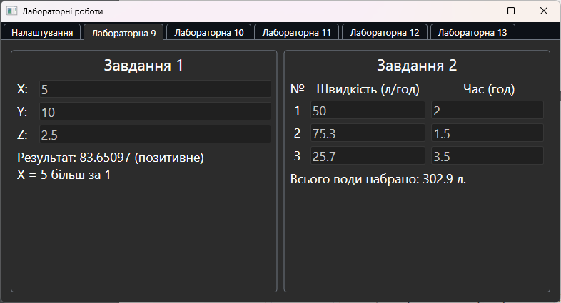
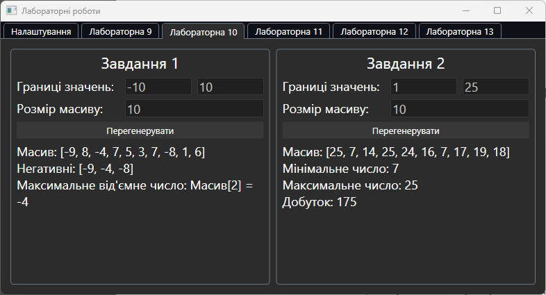
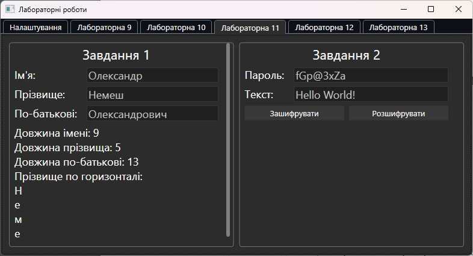
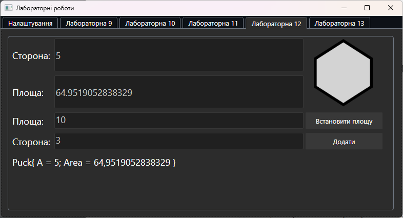
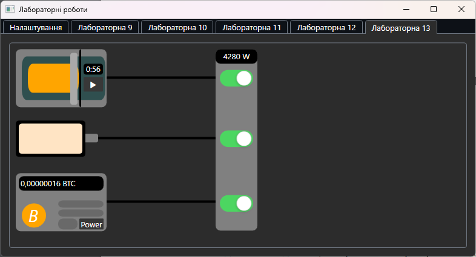
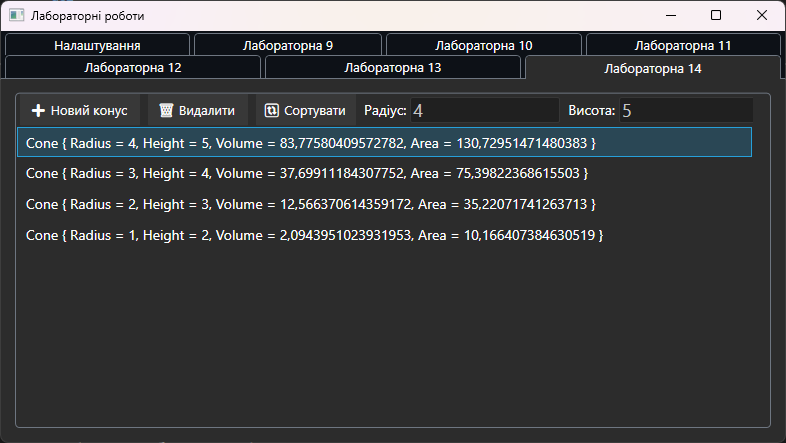

## Лабораторні роботи з курсу "Об'єктно Орієнтоване Програмування"

Цей репозиторій містить проекти для кожної лабораторної роботи а також UI у вигляді одного WPF проекту.

> Лабораторні роботи 1-8 були з використанням С++ і не входять до цього репозиторію.

Варіант виконання робіт - 15.

### Лабораторна робота №9
#### Завдання 1
1. Скласти консольну програму на мові С# у Visual Studio 2017/2019 і
запрограмувати оператори, які:
    - вводять з клавіатури значення дійсних змінних x, y, z;
    - розраховують вираз, зазначений в таблиці 9.1 відповідно варіанту;
    - виводять результат на екран.
2. Додати до складеної програми оператор циклу, що повторює введення даних і
виконання розрахунків, доки не введено значення Х=0.
3. Додати до складеної програми оператори, що виводять словами назву діапазону,
в який попадає вхідне значення Х та значення обчисленого виразу. Назви
діапазонів для Х: «менш за -10», «менш за -1», «більш за 1», «більш за 10». Назви
діапазонів для результату: «негативне», «позитивне».
$$\boxed{a = |cos z + cos y| * (1 + 2x^2)}$$
#### Завдання 2
За продуктивністю трьох труб і часу їх роботи з наповнення басейну, визначити
скільки води набрано в басейн

### Лабораторна робота №10
#### Завдання 1
1. Запрограмувати оператори, які:  
    - Створюють одномірні статичні масиви, котрі задовольняють умовам варіанту
завдання відповідно Вашому номеру за журналом.
    - Заповнюють вихідний масив даними, створеними генератором випадкових чисел.
    - Виконують дії над елементами масивів відповідно завданню.
    - Виводять результат на екран.
*Визначити, чи є серед від'ємних елементів елементи з максимальними
значеннями.*

#### Завдання 2
Написати програму з використанням методів класу System.Array.
1. Створити масив Z (одновимірний або багатовимірний) відповідно варіанту
завдання 
2. Заповнюють масив даними, створеними генератором випадкових
чисел. Вивести на екран значення масиву. Виконати завдання згідно з
варіантом.  
*Обчислиш добуток мінімального й максимального елемента масиву*

### Лабораторна робота №11
#### Завдання 1
1. Запрограмувати оператори, які:
    - Створюють змінні рядкових типів, котрі задовольняють умовам варіанту завдання відповідно Вашому номеру за журналом..
    - Вводять з клавіатури прізвище, ім'я та по батькові.
    - Визначають довжину введених рядків.
    - Виконують дії відповідно варіанту завдання.
    - Виводять результат на екран, додавши до нього коментарі - студент якої
спеціальності і групи виконав завдання.  
*Вивести прізвище в стовпець.*

#### Завдання 2
Запрограмувати деякий спосіб шифрування тексту. Скласти програму
для введення тексту, його шифрування, розшифровування та друку результатів.

### Лабораторна робота №12
1. Створити базовий клас «шайба» (правильний шестикутник, такий, що:
    - його екземпляр містить розмір сторони a.
    - його конструктор без параметра створює екземпляр зі значенням 0, а конструктор з параметрами створює екземпляр з відповідним значенням a.
    - його властивості дозволяють отримувати і привласнювати значення a і отримувати значення площі.
    - метод ToString() повертає рядок у вигляді повідомлення про значення a і площі цієї фігури.
    - операція «+» перевантажена: для двох фігур створює нову фігуру з параметрами (a = a1 + a2), а при додаванні з числом змінює свою площу на цю величину

### Лабораторна робота №13
Описати базовий клас (можливо, абстрактний), у якому за допомогою
віртуальних або абстрактних методів та властивостей задається інтерфейс для
похідних класів.
В усіх класах потрібно перевизначити метод Equals, щоби порівнювались
значення, а не посилання. Визначити в класах усі можливі конструктори.
Метод Main повинен утримувати масив або список з елементів базового
класу, заповнений посиланнями на похідні класи, та демонструвати
використання усіх розроблених елементів класів відповідно варіанту.
Показати на прикладі одного з методів, присутніх у кожному класі,
використання поліморфізму.
Обов’язково продемонструвати різницю між раннім та пізнім зв’язуванням

*Електрик. Визначити ієрархію електроприладів. Включити деякі в
розетку. Порахувати споживану потужність*

### Лабораторна робота №14
Скласти програму, яка виконує наступне:
1. Створює масив з N екземплярів класу, створеного відповідно до варіанта .
2. Виводить інформацію про об'єкти масиву.
3. Сортує масив за заданою ознакою (див. Варіант), використовуючи метод Sort класу
Array.
4. Виводить інформацію про об'єкти відсортованого масиву

Варіант 3. Створити базовий клас «конус», такий, що:
- його екземпляр містить розмір радіусу і висоти.
- його конструктор без параметра створює екземпляр зі значенням 0, а конструктор з
параметрами створює екземпляр з відповідним значенням радіусу і висоти.
- його методи дозволяють отримувати і привласнювати значення радіуса, висоти і об'єму,
виконуючи при цьому відповідні перетворення.
- функція print_val() виводить на екран значення його об'єму. Сортувати масив за об'ємом.

### Посилання
Частина інтерфейсу була взята з [FloatTool](https://github.com/Prevter/FloatTool)

### Ліцензія
Розповсюджується під ліцензією MIT. Див. [LICENSE](LICENSE.md) для деталей.